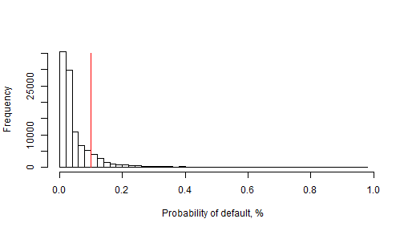

## What the application does

1. Simple scoring model for retail banking.
2. Takes 9 inputs, generates estimated probability of default.
3. Put this borrower on the plot of sample distribution. Like this:

```r
hist(loan_train$logit.prob, breaks=50, main=NULL, xlab="Probability of default, %")
lines(c(0.1, 0.1), c(0, 35000), col="red")
```

 

--- .class #id 

## User instructions

1. Request all mentioned parameters from a potential borrower.
2. Enter all these numbers in fields in the left column of the application page.
3. Click the "Submit" button.
4. Get the probability of loan default.
5. See the placement of the borrower at the distribution histogram.
6. Decide whether issue the loan or not according to bank instructions (issue if cutoff level is higher than some probability, refuse otherwise).
7. Repeat steps 1-6 for another borrower.

--- .class #id

## Technical details

In the application, I use coefficients obtained from previously trained model.
The model was trained using rather large sample.

```r
dim(loans)
```

```
## [1] 104681     12
```
For simplicity of prediction implementation, logistic regression was used.
$$F(x)=\frac{1}{1+e^{-{(\beta_{0}+\beta_{1}x)}}}$$
Out of 10 features, 9 had significant coefficients. Debt ratio was dropped (using this sample; typically, this ratio is considered as important one in financial risk literature).

--- .class #id

## Literature

- Bellovary, Jodi, Don Giacomino, and Michael Akers (2007): A review of bankruptcy prediction studies: 1930 to present. Journal of Financial Education, Volume 33 (Winter 2007).
- Dambolena, Ismael and Joel Shulman (1988): A primary rule for detecting bankruptcy: Watch the cash. Financial Analysts Journal 44(5): 74-78.
- Martin, Daniel, (1977): Early warning of bank failure: a logit regression approach, Journal of Banking and Finance, number 1: 249-276.
- Ohlson, James, (1980): Financial ratios and the probabilistic prediction of bankruptcy, Journal of Accounting Research, Spring: 109-131.
- Wiginton, John, (1980): A note on the comparison of logit and discriminant models of consumer credit behaviour, Journal of Financial and Quantitative Analysis, 15: 757-770.
- Zavgren, Christine, (1983): The prediction of corporate failure: the state of the art, Journal of Accounting Literature, number 2: 1-38.
- Zmijewski, Mark, (1984): Methodological issues related to the estimation of financial distress prediction models, Journal of Accounting Research, 20: 59-82.
